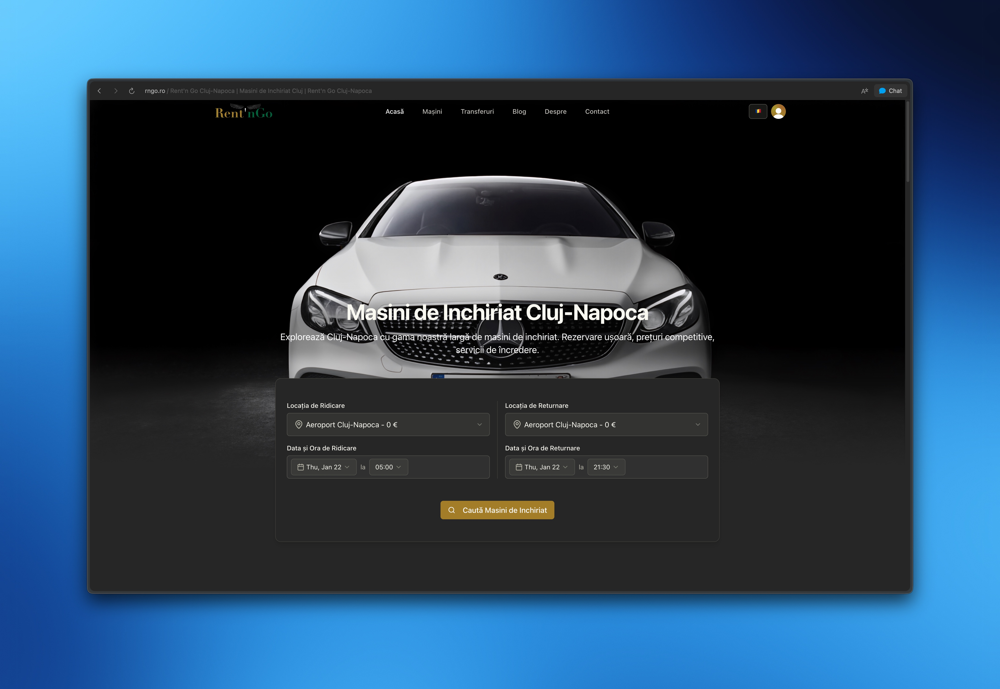

# rentngo



car rental platform for romania. book cars, airport transfers, done.

## run it

```bash
npm i
npm run dev
```

that's it. frontend + backend both start.

## stack

- next.js 15 (app router)
- convex (backend, db, realtime)
- clerk (auth)
- tailwind + shadcn
- mapbox (transfers routing)

## features

- vehicle browsing w/ filters
- tiered pricing (longer rental = cheaper)
- seasonal price multipliers
- airport transfers
- admin dashboard
- i18n (ro/en)

---

built in cluj. works on my machine.
